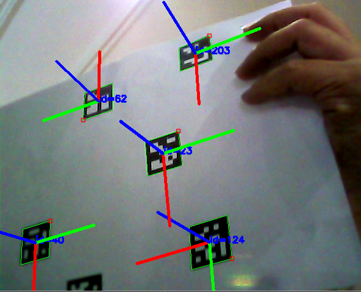

# Camera Calibration, ArUco Markers detection, and ArUco Markers frames

Propose: To use ROS2 humble, and Opencv, together to do camera calibration, and  ArUco Markers detection, and ArUco Markers frames as shown in the image.



## Step 1. Use Ros2 humble package to do camera calibration

follow this tutorial

https://medium.com/starschema-blog/offline-camera-calibration-in-ros-2-45e81df12555

```
sudo apt install ros-humble-camera-calibration
sudo apt install ros-humble-usb-cam
```

Terminal 1

```
ros2 run usb_cam usb_cam_node_exe 
```

Terminal 2
 
```
ros2 run camera_calibration cameracalibrator --size 7x10 --square 0.02   --ros-args -r image:=/image_raw
```

print out file calib.io_checker_200x150_8x11_15.pdf and do calibration. Check the when finished, click save, and look at CLI to see where is the calibration file saved. 

something like ('Wrote calibration data to', '/tmp/calibrationdata.tar.gz')

suppose the calibrated file is saved at /tmp/calibrationdata.tar.gz

### step1 alternatively, use ROS1 to do camera calibration

Terminal 1

```
roscore
```

Terminal 2

```
sudo apt-get install ros-noetic-usb-cam
```

```
roslaunch usb_cam usb_cam-test.launch 
```

Terminal 3

```
rosrun camera_calibration cameracalibrator.py --size 7x10 --square 0.02 image:=/usb_cam/image_raw camera:=/usb_cam
```


## Step 2. Look at yaml file inside the calibrationdata.tar.gz, rewrite marker_detector_pose_estimation.cpp for distCoeffs, and cameraMatrix Mat variables.

compile opencv_marker_detector

```
cd opencv_marker_detector
mkdir build
cd build
cmake ..
make
```

run the program to detect.

```
cd opencv_marker_detector/build
./PoseEstimation
```

Near future: How to submit calibration params to marker detector? ROS topic? file?

